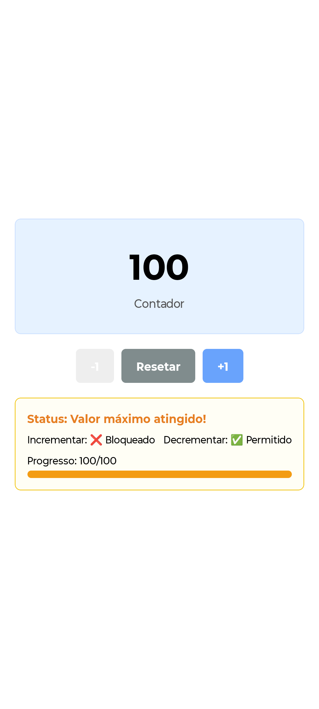

# 📱 Contador com Context API - React Native

Este é um app simples de **contador** criado com **React Native + Expo**, utilizando a **Context API** para gerenciamento global de estado.

## 🎯 Funcionalidades

- ✅ Incrementar o contador (+1)
- ✅ Decrementar o contador (-1)
- ✅ Resetar o contador (voltar para 0)
- ✅ Exibir valor atual em qualquer componente
- ✅ Mostrar status do contador
- ✅ Bloquear botões quando necessário

---

## ⚙️ Regras de negócio

- 🔢 Valor inicial: `0`
- ⛔ Valor mínimo: `0` (não pode ser menor)
- 🚫 Valor máximo: `100` (não pode ultrapassar)
- ✅ Interface reativa que mostra mensagens de bloqueio e uma barra de progresso

---

## 🖼️ Capturas de Tela

### 💯 Contador no valor máximo

<p align="center">
  
</p>


---

## 🚀 Como executar

### 1. Clone o repositório

```bash
git clone https://github.com/talvan15/counterContext.git
cd counterContext

## 📦 Instalação

### 2. Instale as dependências

npm install
# ou
yarn

### 3. Execute com o Expo

npx expo start
